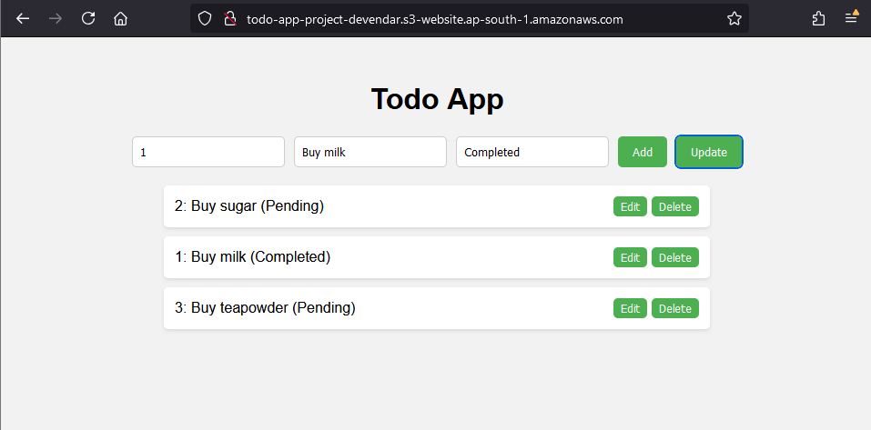

# ✅ Day 18 & Day 19 — [Serverless TODO App](http://todo-app-project-devendar.s3-website.ap-south-1.amazonaws.com/) (Lambda + API Gateway + DynamoDB) (23 & 24 July, 2025)

I spent Day 18 and Day 19 building a **fully working serverless TODO backend** with **AWS Lambda, API Gateway (REST), and DynamoDB**. I **tested everything with `curl` from the terminal** (not Postman). After a lot of debugging, all **CRUD operations (Create, Read, Update, Delete)** are working end-to-end.

---

## 🔧 What I Used

- **AWS Lambda (Python)** — business logic
- **Amazon API Gateway (REST API)** — exposed HTTP endpoints (GET, POST, PUT, DELETE, OPTIONS)
- **Amazon DynamoDB** — table `Todos` with `taskId` (String) as the partition key
- **IAM Roles/Policies** — to allow Lambda to access DynamoDB
- **cURL** — to invoke and test API endpoints from the terminal
- **S3 (Static Website Hosting)** — to host a tiny HTML/JS frontend (later)
- **CloudWatch Logs** — **(planned for Day 20, not done yet)**

---

## 🧱 What I Built

- A **single Lambda function** that switches logic based on `event['httpMethod']`:
  - `GET`   → list all tasks
  - `POST`  → create a task
  - `PUT`   → update a task (handles DynamoDB reserved word `status` properly)
  - `DELETE`→ delete a task
  - `OPTIONS` → CORS preflight

- A **REST API in API Gateway** with **Lambda proxy integration enabled for every method**.

- A **simple HTML + JS frontend** that calls the API and shows tasks (add, edit, update, delete).  


---

## 🧪 How I Tested (with `curl`)

> Replace `<invoke-url>/dev/todo` with your actual API Gateway invoke URL.

### Create
```bash
curl -X POST <invoke-url>/dev/todo \
  -H "Content-Type: application/json" \
  -d '{"taskId":"1","description":"Buy milk","status":"Pending"}'
```
### Read (all)
```
curl -X GET <invoke-url>/dev/todo
```
### Update
```
curl -X PUT <invoke-url>/dev/todo \
  -H "Content-Type: application/json" \
  -d '{"taskId":"1","description":"Buy milk and sugar","status":"Completed"}'
```
### Delete
```
curl -X DELETE <invoke-url>/dev/todo \
  -H "Content-Type: application/json" \
  -d '{"taskId":"1"}'
```
## 🐞 What I Debugged (and Fixed)
- `tasks.forEach is not a function` in the browser  
Cause: My Lambda sometimes returned an object (with `statusCode`, `body`, etc.) and I tried to directly iterate it as an array on the frontend.  
Fix: Parse `result.body` only when needed, and handle both array/object cases.
- CORS preflight failures (400) & `CORS did not succeed`  
Cause: OPTIONS method not properly configured / Lambda proxy not enabled on all methods.  
Fix: Added an OPTIONS method + returned headers:  
`Access-Control-Allow-Origin`, `Access-Control-Allow-Methods`, `Access-Control-Allow-Headers`.
- `Unsupported method: ''`  
Cause: Method/route without Lambda proxy integration.  
Fix: Enabled Lambda Proxy Integration for GET, POST, PUT, DELETE, OPTIONS.
- `ValidationException: reserved keyword: status` (DynamoDB UpdateItem)  
Cause: `status` is a reserved word in DynamoDB.  
Fix: Used `ExpressionAttributeNames={"#stat": "status"}` and referenced `#stat` in the update expression.
- Syntax errors (`expected an indented block after 'elif'`)  
Cause: Misplaced/incorrectly indented `elif` blocks.  
Fix: Rewrote the handler structure cleanly with a proper `if/elif/elif/elif/else`.

## 🧠 What I Learned
- How to structure a single Lambda to handle multiple HTTP verbs cleanly.
- The importance of Lambda Proxy Integration and correct CORS handling in API Gateway.
- How to debug event payloads by printing the entire `event` into logs.
- How to work around DynamoDB reserved keywords using `ExpressionAttributeNames`.
- How frontend/JS needs to carefully handle Lambda proxy responses (`{statusCode, headers, body}`).

## ✅ Final State
- All CRUD operations work from:
  - `curl` ✅
  - My web page hosted on S3 ✅
- Data correctly persists in DynamoDB ✅
- API Gateway correctly invokes Lambda with all methods ✅
- CloudWatch Logs monitoring — to be done on Day 20 ⏭️

## ⏭️ Next (Day 20)
- Enable & read CloudWatch Logs for Lambda:
  - Print entire event to logs for observability
  - Track errors/exceptions (e.g., JSON parse, missing keys)
- Start 3 interview questions/day (tech + scenario)

## Personal Note

This took two full days (Day 18 & Day 19). I failed many times, fixed many mistakes, and learned deeply — now my TODO app works across Lambda + API Gateway + DynamoDB + S3. I’m fully satisfied with the effort and the outcome.

Truth. Skill. Consistency.
*— Devendar Nandaiahgari*
