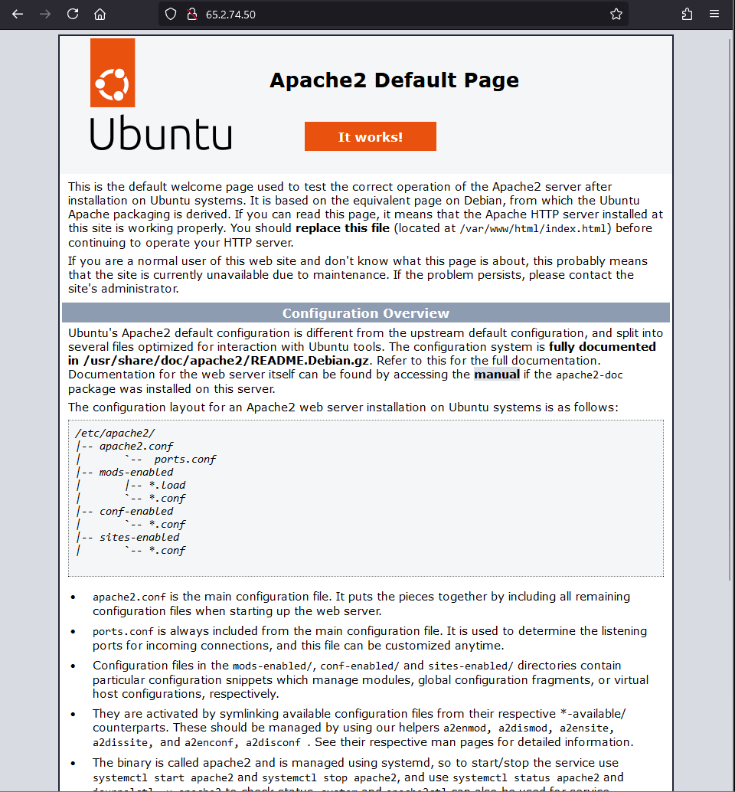
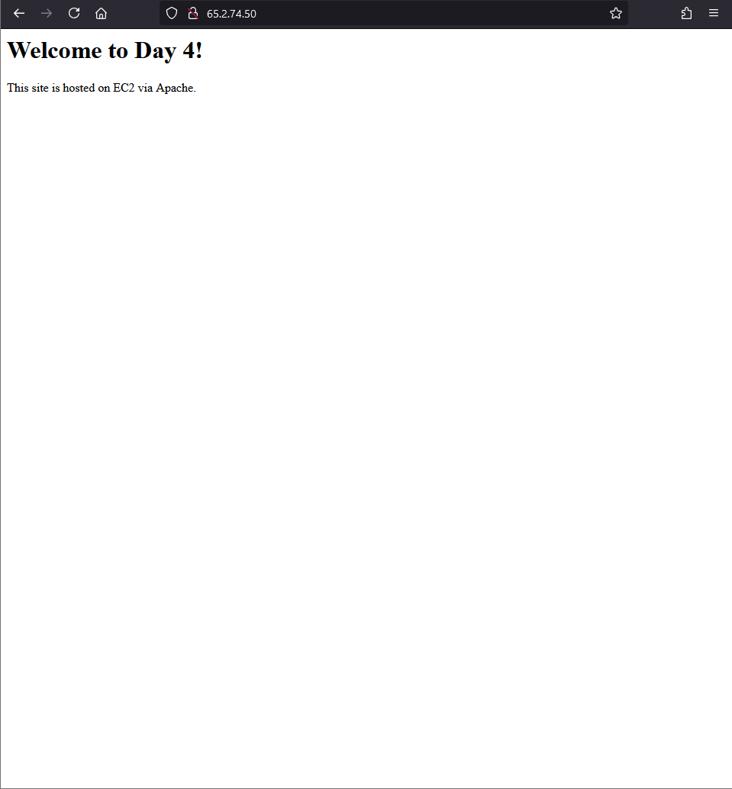

# 📦 Day 4: Apache Web Server on EC2 (Manual Static Website Hosting)

### 🗓️ Date: July 9, 2025  
### 🌐 Theme: EC2 + Apache + Static Website

---

## ✅ What I Did

- Launched a **Free Tier EC2 Ubuntu instance**
- Connected to EC2 via **SSH** using `.pem` key
- Installed **Apache2 web server** using Linux CLI
- Replaced default Apache page with my **custom HTML**
- Accessed the website via **public IP**
- Took screenshot of **live webpage** (hosted from EC2)

---


## 🧠 Skills Practiced

- EC2 provisioning via AWS Console
- SSH key setup and secure login
- Apache installation via CLI
- File creation and redirection using `echo` and `tee`
- Server access and verification

---

## 🧠 What I Learned

- Launching EC2 (Ubuntu 22.04) and SSH access using `.pem` key
- Installing packages via `apt`
- Apache Web Server: Installation, Configuration, Hosting
- Working with Linux commands: `sudo`, `apt`, `echo`, `tee`, `systemctl`
- Where Apache stores web files: `/var/www/html/index.html`
- Using `systemctl` to start/enable services

---

## 🛠️ Commands Used

    ```bash
    sudo apt update
    sudo apt install apache2 -y
    sudo systemctl start apache2
    sudo systemctl enable apache2
    echo '<html><head><title>Dev'"'"'s Apache Site</title></head><body><h1>Welcome to Day 4!</h1></body></html>' | sudo tee /var/www/html/index.html

🌍 Project Outcome

    Hosted a working static website from my own EC2 instance using only Linux commands.
    This is the base of many real-world setups in DevOps, IaaS, and cloud hosting.

📸 Screenshot

✅ Added browser screenshot of Apache default page

✅ Added browser screenshot of public IP showing my hosted custom HTML pag

