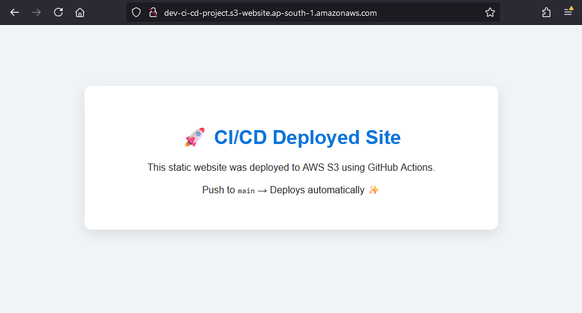

# 🚀 CI/CD Static Website Deployment to AWS S3 using GitHub Actions

This project demonstrates how to automatically deploy a static website to an AWS S3 bucket using GitHub Actions.

---

## 📂 Project Structure

ci-cd-project/  
├── .github/  
│ └── workflows/  
│ └── deploy.yml # GitHub Actions workflow  
└── static-site/  
├── index.html # Main HTML file  
└── style.css # Styling  


---

## 🔧 Tools Used

- **GitHub Actions** – CI/CD pipeline
- **AWS S3** – Hosting static website
- **YAML** – Workflow configuration

---

## 🛠️ Setup Instructions

1. **Create an S3 Bucket**  
   - Name: `dev-cli-bucket-01` (or your own)
   - Enable static website hosting
   - Make bucket public or use CloudFront for secure delivery

2. **Generate AWS IAM Credentials**  
   - Provide programmatic access
   - Permissions: S3 full access (for this demo only)

3. **Add GitHub Repository Secrets**  
   In your repo:
   - Go to **Settings > Secrets and Variables > Actions**
   - Add the following secrets:
     - `AWS_ACCESS_KEY_ID`
     - `AWS_SECRET_ACCESS_KEY`

4. **Push Files to Main Branch**
   - Place your static files under `static-site/`
   - Your `deploy.yml` should watch for changes in this folder

---

## 🚦 Workflow Trigger

This GitHub Actions workflow is triggered **on push to the `main` branch** inside the `static-site/` folder.  
When triggered, it uploads all files to the specified S3 bucket.

---

## ✅ Features

- Fully automatic deployment
- Clear folder separation (`.github`, `static-site`)
- Simple, modular, beginner-friendly setup

---

## 📄 Sample Files

### `index.html`

```
<h1>🚀 CI/CD Deployed Site</h1>
<p>This site is live from AWS S3</p>
```

### `style.css`
```
.container {
  max-width: 600px;
  margin: auto;
  text-align: center;
}

```

---

## 🌐 After Deployment  
Once GitHub Actions completes successfully:
- Visit your S3 static website endpoint URL
- You’ll see the latest version of your site live ✨

---

## 📸 Screenshot  


---

## 🙏 Credits
- Inspired by the clean DevOps workflows using GitHub Actions
- Devendar Nandaiahgari — AWS Dev in progress 👨‍💻

---

## 🧠 Bonus Tips
- For security, use IAM roles with least privilege.
- Add versioning or a build step for real-world apps.
