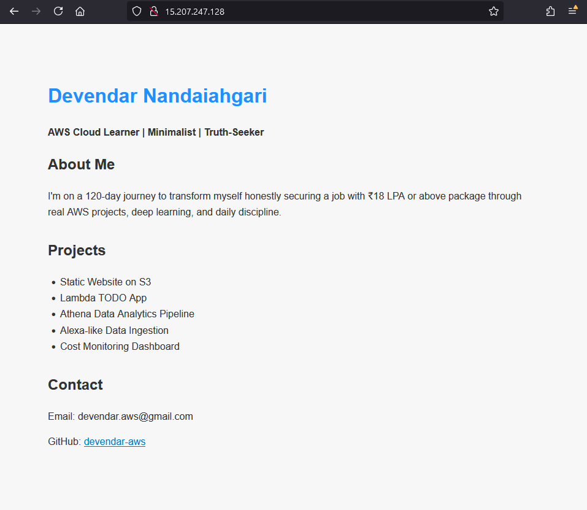

# 🖥️ Mini Portfolio Site Hosting on EC2 (Apache)

This project demonstrates how to host a static HTML portfolio website on an AWS EC2 instance using Apache HTTP Server. This is a beginner-friendly way to understand basic web hosting, Linux administration, and how cloud infrastructure works.

---

## 📌 Use Case

Deploy and publicly host a basic portfolio website using Amazon EC2 and Apache.

---

## 🛠️ Tools & Services Used

- **AWS EC2 (Amazon Linux 2)**
- **Apache HTTP Server**
- **Git Bash / Terminal**
- **Custom User Data Script**
- **Security Groups**

---

## 🚀 Deployment Steps

### ✅ 1. Prepare Your Portfolio Code

- Create a simple static site (`index.html`, `style.css`, images, etc.) locally.
- Zip the folder as `portfolio-site.zip`.

---

### ✅ 2. Launch EC2 Instance (Amazon Linux 2)

- Region: Choose your nearest AWS region
- AMI: **Amazon Linux 2 AMI (x86_64)**
- Instance Type: **t2.micro (Free Tier)**
- Key Pair: Choose existing or create new
- Storage: Default (8 GB is enough)
- Security Group:
  - Allow **HTTP (80)** from anywhere
  - Allow **SSH (22)** from your IP

---

### ✅ 3. Add This User Data (to install Apache automatically)

Paste this in the **Advanced > User data** section:

    #!/bin/bash
    yum update -y
    yum install httpd -y
    systemctl start httpd
    systemctl enable httpd
    echo "<h1>Apache is running</h1>" > /var/www/html/index.html

### ✅ 4. Connect to EC2 via SSH
Open Git Bash or your terminal and run:  
`ssh -i "your-key.pem" ec2-user@<your-ec2-public-ip>`  
(Replace your-key.pem and `<your-ec2-public-ip>`)

### ✅ 5. Transfer Portfolio Files to EC2
Use scp (from your local terminal) to send the zipped site:  
`scp -i "your-key.pem" portfolio-site.zip ec2-user@<your-ec2-public-ip>:~`

### ✅ 6. SSH into EC2 and Deploy Files
Inside your EC2 session:  
`unzip portfolio-site.zip`  
`sudo cp -r portfolio-site/* /var/www/html/`  
This replaces the default Apache welcome page with your custom HTML.

### ✅ 7. View Your Site
Open your browser:  
`http://<your-ec2-public-ip>`  
🎉 You should now see your portfolio site live on the web!

## 📂 Folder Structure (Example)
portfolio-site/  
│  
├── index.html  
├── style.css  
├── images/  
└── scripts/  

## 🔐 Security Note
- This method exposes your website via public IP. For production-grade setup, you should:
- Use Route 53 with domain names
- Add HTTPS via Let's Encrypt
- Harden Apache and Linux with best practices

## ✅ Learning Outcomes
- How to launch and connect to EC2
- How Apache serves HTML over HTTP
- Basic Linux file permissions and structure
- Practical usage of SCP, SSH, yum, and systemctl

## 📝 Author
Devendar Nandaiahgari — [GitHub](https://github.com/devendar-aws/) | LinkedIn

## 📸 Screenshot (Optional)
Screenshot of the live running site  

